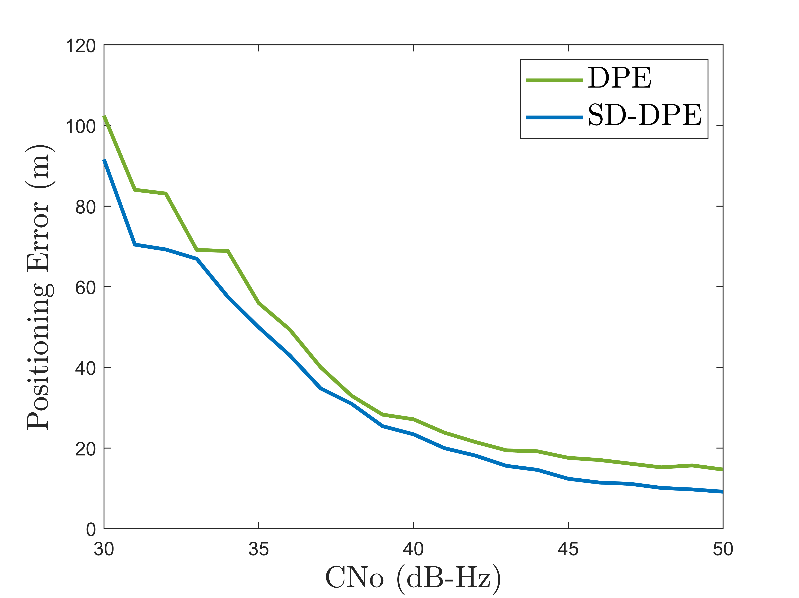

# SD-DPE

In this project, we extend the Direct Position Estimation (DPE) approach to Differential Positioning GNSS (DPGS) by utilizing raw satellite signals from multiple receivers. This method, termed SD-DPE, is designed to retain the high sensitivity of standard DPE while enhancing positioning performance by eliminating common error terms, such as ionospheric and tropospheric errors.

We propose the SD-DPE approach by reconstructing raw signals from distributed base stations. This offers the following advantages:

1. Circumvents noise caused by cross-correlation between signals from different satellites.
2. Facilitates the implementation and popularization of the DGPS DPE algorithm due to the widespread distribution of base stations and easy access to their measurements.

The performance of the SD-DPE approach is influenced by three key factors:

1. Common ionospheric and tropospheric errors.
2. Uncertainty in the measurements from the base station.
3. Signal quality from the rover.

## Scripts

- **`DPE_SD_ARS_varying_CNo.m`**  
  Demonstrates the relationship between positioning precision and the carrier-to-noise ratio (CN0) of the rover signal.  
  

- **`DPE_SD_ARS_varying_iono.m`**  
  Demonstrates how positioning precision is affected by ionospheric error.

- **`DPE_SD_ARS_varying_sigma_range.m`**  
  Demonstrates the impact of measurement uncertainty from the base station on positioning precision.  

## Notes
We also implemented the SD-DPE with the real-world over-the_air signal. Due to acknowledgement, the generated data and algorithm are not included in this repository. please refer to the following paper or contact tang.shu@northeatern.edu.  
	```
     Liu, X., Ribot, M.Á., Gusi-Amigó, A., Closas, P., Garcia, A.R. and Subirana, J.S.,
	 2020, September. RTK feasibility analysis for GNSS snapshot positioning. In Proceedings of the 33rd International Technical Meeting of the Satellite Division of The Institute of Navigation (ION GNSS+ 2020) (pp. 2911-2921).  
     ```  
     [INO GNSS+ 2020: https://www.ion.org/publications/abstract.cfm?articleID=17768](https://www.ion.org/publications/abstract.cfm?articleID=17768)