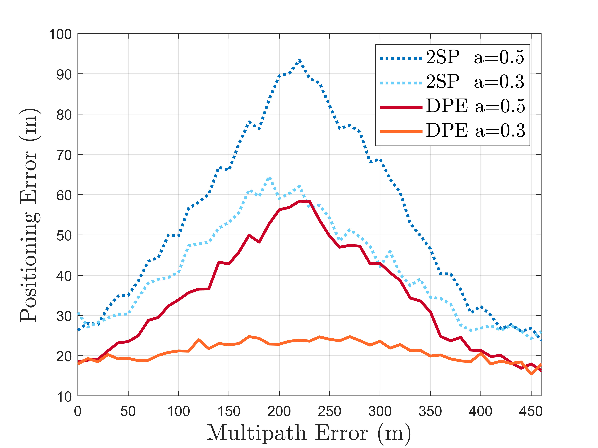

# DPE for Multipath Mitigation

The Direct Position Estimation (DPE) approach has significant potential to enhance positioning performance in multipath environments. This is due to its ability to fuse satellite signals at an early stage and operate directly in the navigation domain. In this work, we demonstrate this capability by presenting the Multipath Error Envelope (MEE) and comparing tracking performance under realistic multipath channel simulations using LMSCM by DLR.

## Scripts

- **`generate_extra_sat_info.m`**  
	Generates additional satellite information, complementing the pre-generated satellite data in `load_data/sat6_info_original.mat`.

- **`DPE_multipath_synthetic_data.m`**  
	Generates received signals under a multipath (LOS + 1 NLOS) environment.  

- **`DPE_multipath_error_vs_pos_error.m`**  
	Computes positioning errors and plots Multipath Error Envelopes (MEEs) based on the signals generated by `DPE_multipath_synthetic_data.m`.  
	  
	
- **`DPE_multipath_LMSCM_data.m`**  
	Simulates received signals in an LMSCM multipath environment.

- **`DPE_multipath_LMSCM_pos_error.m`**  
	Computes and compares the positioning performance of the traditional 2SP approach and the DPE approach, based on signals generated by `DPE_multipath_LMSCM_data.m`.  
	  
	
## Notes

1. **LMSCM**: The LMSCM (Land Mobile Multipath Channel Model V3.0) is a software simulation of a realistic satellite multipath channel. For more details, refer to the [DLR website](https://www.dlr.de/en/kn/about-us/departments/communications-systems/vehicular-applications-group/satellite-navigation-multipath-channel-models). The scenarios include pedestrian suburban, pedestrian urban, car suburban, and car urban environments.

2. **Data Availability**: Due to space limitations, the generated data is not included in this repository. You can use the provided scripts to generate the data yourself, or contact tang.shu@northeastern.edu for more information.
