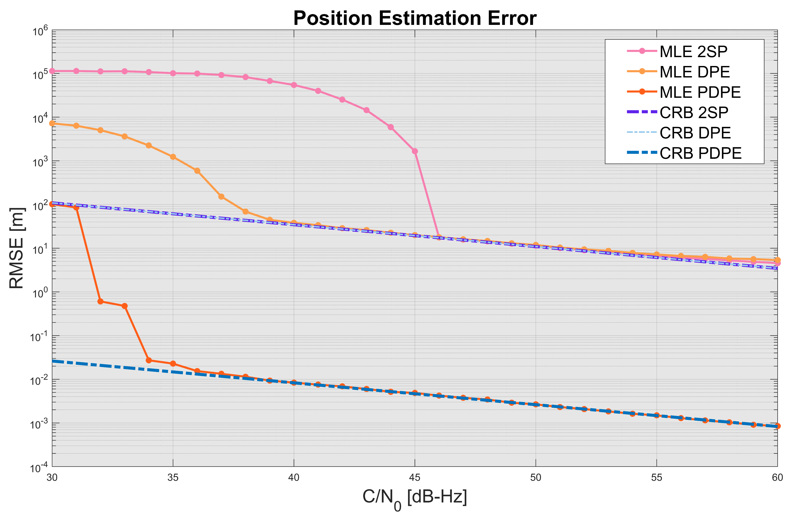
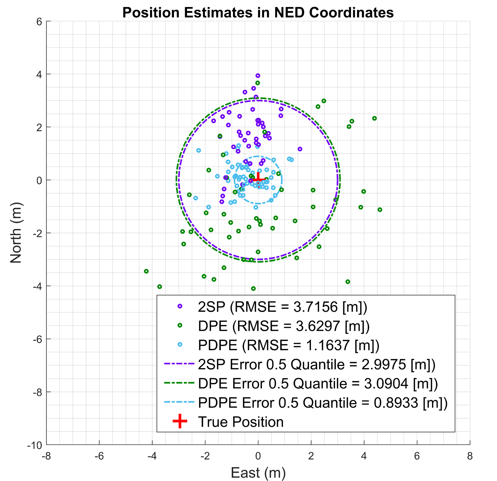

# Precise DPE

This project is divided into two parts:

- **`theoretical` Folder**:  
  Contains simulations for the Precise DPE (PDPE) approach. Here, we compare the bound and RMSE (Root Mean Square Error) of the standard DPE and the proposed PDPE.  
  

- **`over_air` Folder**:  
  Contains experiments for PDPE using practical over-the-air signals. The satellite information is obtained using traditional methods via GNSS-SDR.  
  

**Note**: 
	--	In the code, comments, and figures, you may encounter terms like *DPE with C* or *DPE with Carrier Phase*. These terms refer to the proposed PDPE algorithm.  
 
 For more details or to cite this work, refer to the paper:  
 
     ```
     Tang, S., Li, H., Calatrava, H. and Closas, P.,
     2023, April. Precise direct position estimation: Validation experiments. In 2023 IEEE/ION Position, Location and Navigation Symposium (PLANS) (pp. 911-916). IEEE.
     ```
     [INO PLANS 2023: https://ieeexplore.ieee.org/abstract/document/10140046](https://ieeexplore.ieee.org/abstract/document/10140046)
