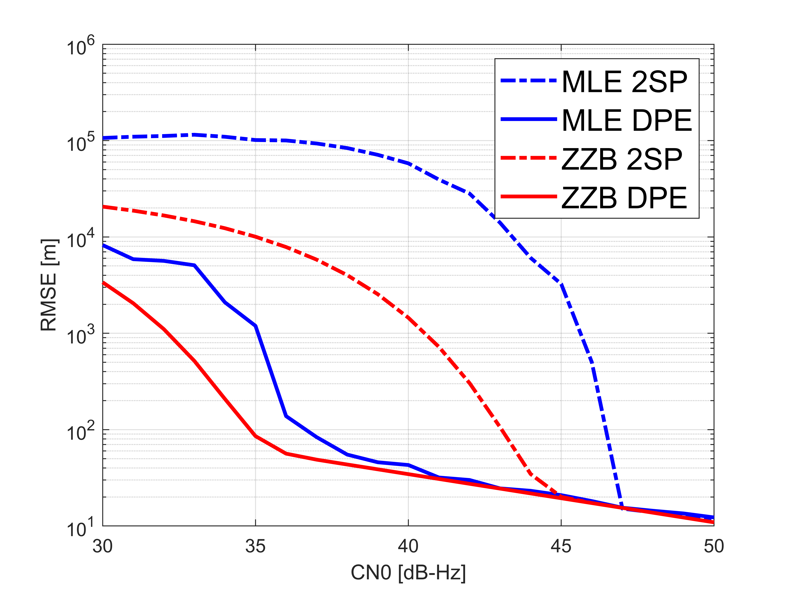
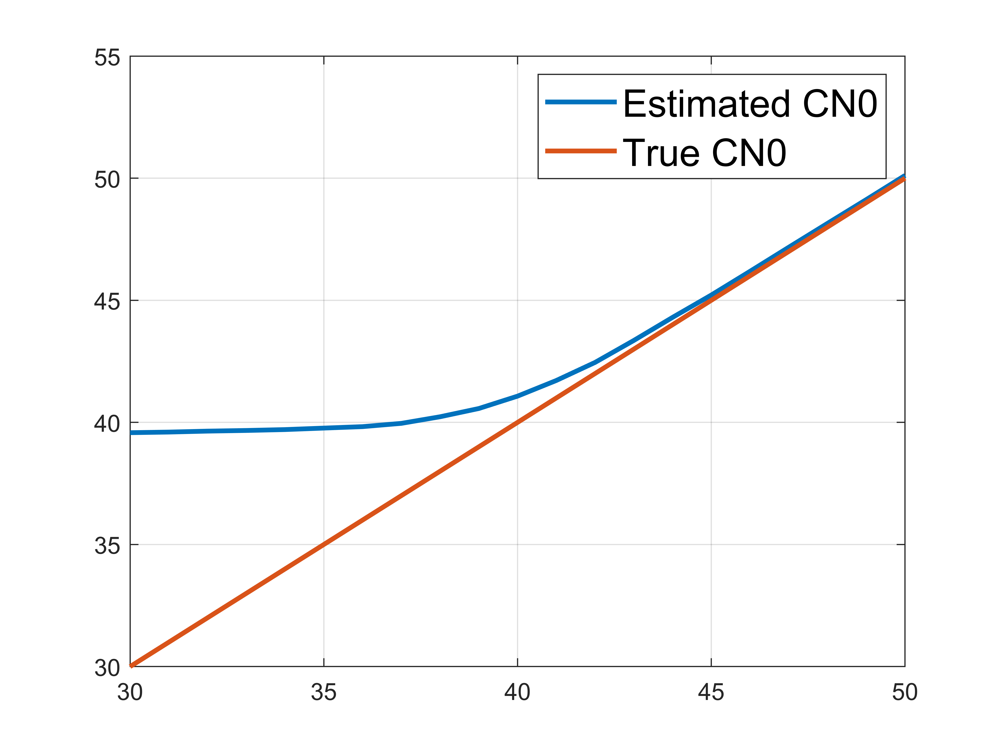

DPE approach is a novel PVT solution and a high-sensitivity receiver design in the context of GNSS. It solves the PVT via the raw receievd signal without estimating the intermediate observables, e.g. pseudorange and Doppler shift.  

The early combination of the satellite information in the Cross Ambuguity Functions enables the high-sensitivity property. The following figures show the bound/RMSE of DPE approach compared to traditional two-step approach, and the effective CN0 achieved by DPE.  

  

  


For more details or to cite this work, refer to the paper:  
 ```
 Closas, P. and Gusi-Amigo, A.,
 2017. Direct position estimation of GNSS receivers: Analyzing main results, architectures, enhancements, and challenges. IEEE Signal Processing Magazine, 34(5), pp.72-84.  
 ```  
 [IEEE SPM 2017: https://ieeexplore.ieee.org/abstract/document/8026199](https://ieeexplore.ieee.org/abstract/document/8026199)

